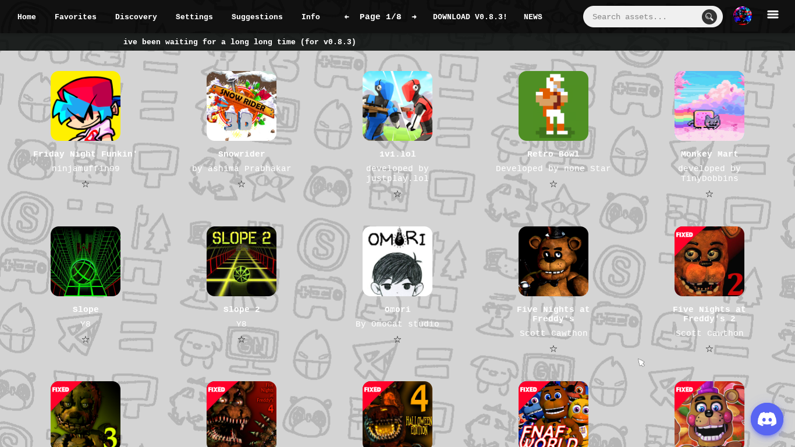

# WannaSmile V0.8.3

## Preview

## Description
Wannasmile is an open source asset library
which can freely be modified & contributed
to, version **0.8.3** brings an abundance of
new features & updates, changes include:

- working anchor url links
- 6 custom cursors & 10 themes! (edit in settings)
- multi-library based stickers (quote system)
- auto updating quotes, no redeployments needed.
- pages 7 and 8 completed (75 assets per page)
- new discord server :D **(join here:https://example.com)
- chat system widget, suggested by **KaiCar**
- soundscape v1 FULL RELEASE (info)
- PERSONIFIED v1.3 (info)
- sundaezipper now automatically updates to new releases of wannasmile,personified, and soundscape.
- best of all **somehow** EVEN FASTER Loading time!

view changes inside the release:https://example.com

# Contributors:

# SOCIALS
Follow Mcmatty Obriore on Youtube for release information & update drops:

